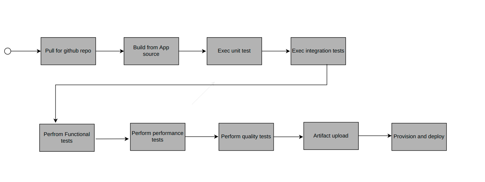
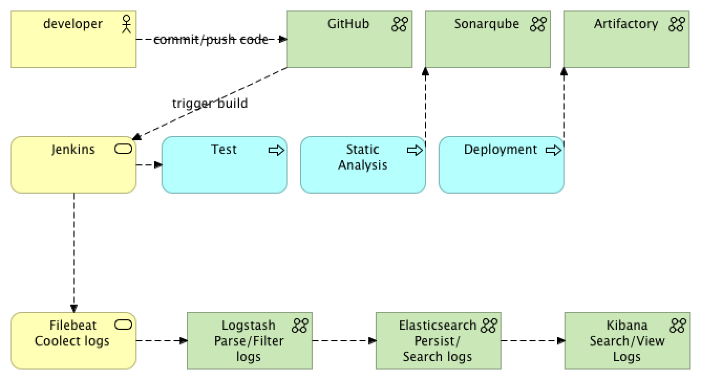

<h1>Testlab infrastructure implemented for the CI/CD pipeline</h1>

Jenkins machine is used to orchestrate the CI/CD pipeline flow
Ansible Tower was used in the lab to create all infrastructure for this lab to provision the application
Vagrant was used to create the virtual machines repressening Ansible tower host, Jenkins, nexus and Sonar
Maven can manage, set and deploy a Java project.
GIT for source code management and control.
SonarSource to assess the code quality in the CI/CD pipeline.
Nexus or JFrog as the repository for artifact binaries.

<h2>An infrastructure architecture</h2>

ALM (Application Lifecycle Management) scenarios can be emulated within a POC environment to prove the CI/CD concept. 

SonarSource:  1 vCPU with 2028m RAM
Nexus: 1 vCPU with 1024m RAM
Application: 1 vCPU 512m RAM
Jenkins: 1 vCPU with 1024m RAM
A CI/CD POC with the aforementioned components contains the following architectural elements:

  <ol>
  <li>Github -  where the project is hosted and where Jenkins will poll for changes to start the pipeline flow.</li>

  <li>SonarSource - source code analysis server. If anything goes wrong during the analysis (e.g. not enough unit tests), the flow is interrupted. This step is important to guarantee the source code quality index.</li>

   <li>Nexus or JFrog - is the artifact repository. After a successful compilation, unit tests and quality analyses, the binaries are uploaded into it. Later those binaries will be downloaded by Ansible during the application deployment.</li>

  <li>Ansible Playbook deployed using ansible tower by using a YAML file integrated in the application source code, deploys the Spring Boot App on to a CentOS machine.</li>

  <li>Jenkins - is our CI/CD process orchestrator. It is responsible to put all the pieces together, resulting in the application successfully deployed in the target machine.</li>

  <li>An Ansible Playbook can be used to provision the infrastructure, using roles from the Ansible Galaxy community. Ansible Galaxy a primary source to learn Ansible.  Often the environment for VMs is managed by Vagrant with libvirt.  Details can be accessed in the project Vagrant ALM at Github.</li>
  </ol> 

<h2>Pipeline Flow example</h2>

Demo environments should do the following pipeline, though real-world prod systems may have slightly more complicated flows depending on the use case, type of apps, existing legacy systems, etc.

Pipeline Flow:

The process starts by pulling the application source code from Github.
Project version is updated according to the build number. 

The webhook triggers the build process of the jenkins pipeline anytime when a code commit occurs.  

After updating the project’s version, Jenkins starts building the source code using Maven.
After a successful compilation, the pipeline will perform unit tests. If nothing goes wrong during the unit tests, the pipeline flow initiates the integration tests.
The test framework creates all the infrastructure needed for the tests: an in-memory database with test data and a small web server to deploy the application.
The integration tests are considered a success when all requests were validated against the application deployed in the test environment.
The output from unit and integration tests is a coverage report, which will be one of the artifacts used by Sonar server to generate quality metrics. The other one is the application source code. If the quality gate defined in the Sonar server is not met, the pipeline flow will fail.
If everything is okay, the flow stops its execution and waits for approval. The Jenkins server provides an interface for someone with the right permissions to manually promote the build.

The pipeline will executes the flow and uploads the compiled artefact to the Nexus or JFrog repo.  Now we have a new app snapshot which can be deployed. 
Ansible now enters the picture.

The pipeline flow sets the required parameters such as the compiled artefact URL and the target host to execute the Ansible Playbook afterward. The Playbook is used to automate all target host configuration. In this many environments we can use this to install Java and to prepare the environment to receive the Spring Boot Application as a service. The Playbook is going to install the application as a service and will poll its HTTP port until it receives a valid response to make sure the deployment was successful.
 

After the Ansible Playbook execution, the last step could be to send a notification to every stakeholder regarding the results of the new deployment via email or slack.
Infrastructure provisioning

Ansible roles that could automate the actors in a typical design as given in this example including a Sonar and Jenkins server could lead to the following Playbook:

---

- name: Deploy Jenkins CI

hosts: jenkins_server

remote_user: vagrant

become: yes

 

roles:

  - geerlingguy.repo-epel

  - geerlingguy.jenkins

  - geerlingguy.git

  - tecris.maven

  - geerlingguy.ansible

 

- name: Deploy Nexus Server

hosts: nexus_server

remote_user: vagrant

become: yes

 

roles:

  - geerlingguy.java

  - savoirfairelinux.nexus3-oss

 

- name: Deploy Sonar Server

hosts: sonar_server

remote_user: vagrant

become: yes

 

roles:

  - wtanaka.unzip

  - zanini.sonar

 

- name: On Premises CentOS

hosts: app_server

remote_user: vagrant

become: yes

 

roles:

  - jenkins-keys-config

 

Group roles together to provide a desired infrastructure, example Jenkins’ provision:

- name: Deploy Jenkins CI

hosts: jenkins_server

remote_user: vagrant

become: yes

 

roles:

  - geerlingguy.repo-epel

  - geerlingguy.jenkins

  - geerlingguy.git

  - tecris.maven

  - geerlingguy.ansible

 

The above defines a host group where Jenkins is deployed and describes the role used to deploy the Jenkins server.  For instance, we may need the EPEL repository for the CentOS to be enabled, the Jenkins installation itself and GIT, Maven and Ansible which are all required for the pipeline. With barely 11 lines of code, we have a Jenkins server up and running prepared to start our CI/CD process.

To get this infrastructure ready, we took the advantage of the integration between Vagrant and Ansible.  With a simple “vagrant up” on the Vagrant file directory, we have the lab environment ready for the test. 

Application deployment

The pipeline has been designed to prepare the application binaries, now called “artifact”, and to upload them in Nexus. The artifact can be reached in Nexus by an URL usually called Artifact URL. Ansible is also part of the pipeline and will receive the Artifact URL as the input for deployment. Thus, Ansible will be responsible not only for the deployment but also for the machine provisioning.

Ansible Playbook deploys our application on the target host:

---

- name: Install Java

hosts: app_server

become: yes

become_user: root

roles:

  - geerlingguy.java

 

- name: Download Application from Repo

hosts: app_server

tasks:

  - get_url:

      force: yes

      url: "{{ lookup('env','ARTIFACT_URL') }}"

      dest: "/tmp/{{ lookup('env','APP_NAME') }}.jar"

  - stat:

      path: "/tmp/{{ lookup('env','APP_NAME') }}.jar"

 

- name: Setup Spring Boot

hosts: app_server

become: yes

become_user: root

roles:

  - { role: pellepelster.springboot-role,

      spring_boot_file: "{{ lookup('env','APP_NAME') }}.jar",

      spring_boot_file_source: "/tmp/{{ lookup('env','APP_NAME') }}.jar",

      spring_boot_application_id: "{{ lookup('env','APP_NAME') }}"

  }

 

This Playbook will only perform three tasks:

Install Java based on a pre-defined role from Ansible Galaxy
Download the binaries from the Nexus repository based on the input from Jenkins
Set up the application as a Spring boot service again using a role from the community
 

The Playbook is in the application repository, which means that the application knows how to deploy itself. By using the Ansible Jenkins plugin, it is possible to call a Playbook from the pipeline by setting the variables required to execute it.

def artifactUrl = "http://${NEXUS_URL}/repository/ansible-meetup/${repoPath}/${version}/${pom.artifactId}-${version}.jar"

 

withEnv(["ARTIFACT_URL=${artifactUrl}", "APP_NAME=${pom.artifactId}"]) {

  echo "The URL is ${env.ARTIFACT_URL} and the app name is ${env.APP_NAME}"

 

  // install galaxy roles

  sh "ansible-galaxy install -vvv -r provision/requirements.yml -p provision/roles/"      

 

  ansiblePlaybook colorized: true,

  credentialsId: 'ssh-jenkins',

  limit: "${HOST_PROVISION}",

  installation: 'ansible',

  inventory: 'provision/inventory.ini',

  playbook: 'provision/playbook.yml',

  sudo: true,

  sudoUser: 'jenkins'

}

 

To make this happen, the target host must have the Jenkins user and its keys properly configured. This was done while provisioning the lab.  All target hosts are CentOS machines with the Jenkins user and its key already set up.  There’s a Ansible role to configure the user and its keys. This has been done since it is required in order to have Ansible access the host.

Productivity Enhancers

Ansible with Jenkins:

Prepare the target host with the Jenkins user and its SSH keys. The target host could be a pod on Red Hat OpenShift, a Virtual Machine, bare metal, etc. Doesn’t matter. Ansible needs a way to connect to the host to perform its magic.
Set the Jenkins user’s private key on the credentials repository. That way you can easily retrieve it on the pipeline code and send it as a parameter to the Ansible plugin.
Before running the deploy Playbook, consider installing all required roles on the Jenkins server. This could be done by performing a good old shell script run on the requirements file during the pipeline execution: “sh "ansible-galaxy install -vvv -r provision/requirements.yml -p provision/roles/"”.

For the next steps, we are going to look at managing Jenkins build logs in a dockerized environment.

The idea with ELK stack is to collect logs with Filebeat (or any other *beat), parse, filter logs with Logstash and send them to Elasticsearch for persistence. Then, the logs view view will be available in Kibana.

On top of that, because Logstash is a heavyweight JRuby app on JVM, you either skip it or use a way smaller application called Filebeat, which is a Logstash log forwarder. All it does is collecting the logs to send them to Logstash for further processing.

In case you don’t have any filtering and parsing requirements, Logstash can be skipped altogether. Instead,  Filebeat’s elastic output can be used to send the logs directly to Elasticsearch.

In our example, it won't be the case to run  Filebeat in a separate container. But, it will be used instead a custom Jenkins image with preinstalled Filebeat. 

So, a summary of what we are going to look at today:
<ol>
<li>Configure and run Logstash in a Docker container.</li>
<li>Configure and run Elasticsearch in a Docker container.</li>
<li>Configure and run Kibana in a Docker container.</li>
<li>Run Jenkins with preinstalled Filebeat to send the logs into ELK.</li>
</ol>

1. Configure and Run Logstash in a Docker Container
We can docker-compose file called docker-compose-elk.yml to add all the containers related to ELK.

Now we need to configure Logstash in logstash.conf.

With the current configuration for file logstash.conf, all it does is to show the logs while displaying the output so we can check if it is actually working.

Then, jenkins can run the new stack through the command from the file download.sh
docker-compose -f docker-compose-elk.yml -f

2. Configure and Run Elasticsearch in a Docker Container
The next step is adding Elasticsearch to the stack:
version: "3.1"

services:

  logstash:
    image: logstash:2
    volumes:
          - ./:/config
    command: logstash -f /config/logstash.conf
    links:
     - elasticsearch
    depends_on:
     - elasticsearch

  elasticsearch:
     image: elasticsearch:5.5.2
     ports:
      - "9200:9200"
     volumes:
      - "./en_data/en_data:/usr/share/elasticsearch/data/"

  kibana:
    image: kibana:5
    ports:
     - "5601:5601"
    links:
     - elasticsearch
    environment:
      ELASTICSEARCH_URL: http://elasticsearch:9200
    depends_on:
     - elasticsearch

We also added links and dependency on Elastic to Logstash, so it can see it and wait for it as well. Now, we can directlysend messages to Elastic without requiring to configure Logstash based on the result from this output:

input { beats {      port => 5044    }  }
output {
  stdout { codec => rubydebug }
  elasticsearch { hosts => ["elasticsearch:9200"] }

}

3. Configure and Run Kibana in a Docker Container
Kibana can be added in the stack in the next steps.

  kibana:
    image: kibana:5
    ports:
     - "5601:5601"
    links:
     - elasticsearch
    environment:
      ELASTICSEARCH_URL: http://elasticsearch:9200
    depends_on:
     - elasticsearch

